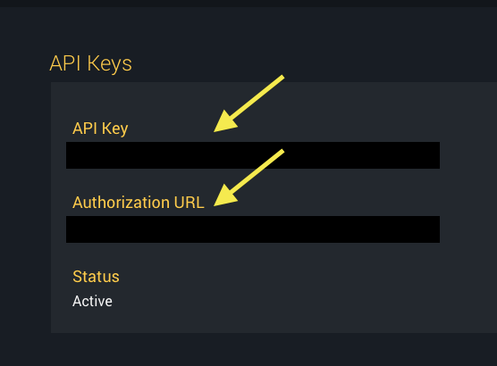
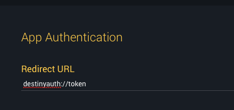

# DestinyApiAuthHelper

This application is a small app to facilitate getting access tokens using Bungie.net's [OAuth-style authentication](https://www.bungie.net/en/Help/Article/45481).  This is provided as a convenience for individuals that want to prototype some ideas without having to set up another means of fetching their tokens.

## Setup

You'll need to get your stuff organized in order to get an access token.  First, you'll need to [register an application](https://www.bungie.net/en/Application/) with Bungie.net.  You'll need to fetch the API Key from the application information.

You'll also need to enter a "redirect url".  This is what this application actually provides.  It's a small app that just registers the `destinyauth://`.  When the Bungie.net authentication page opens the callback URL, it'll launch this app with the information necessary to generate your access tokens.

## How to use

With Bungie.net appropriately configured, launch DestinyApiAuthHelper and enter your API Key where indicated.  Go back to the Bungie.net application information page and open the "Authorization URL".  From that page, press the "Allow" button.  Your access tokens should be generated and appear in the selectable text fields.

## `curl` auth token demo

Assuming that you have received a valid access token (they're good for one hour and then need to be refreshed) and your api key, you could, say, query for your characters complete stats using:

	membershipType=1 #Use '1' for Xbox, '2' for PSN
	destinyMembershipId=0000000000000 #Received by querying "/SearchDestinyPlayer/${membershipType}/${displayName}/" where "displayName" is the gamertag
	characterId=0000000000000 #Received by querying "/{membershipType}/Account/{destinyMembershipId}/Summary/" and chosing a character
	
	apiKey="<>" #Received from Bungie.net application information
	authToken="<>"#Received from DestinyApiAuthHelper
	
	endpoint="/${membershipType}/Account/${destinyMembershipId}/Character/${characterId}/Complete/"
	curl "https://www.bungie.net/platform/destiny${endpoint}" \
		--header "X-API-Key: ${apiKey}" \
		--header "Authorization: Bearer ${authToken}"
	

Provided that you've entered the appropriate values (which requires work on your end), you should be looking at a heinously large json blog that represents your character.  Congratulations.  Your access token worked.  Please note that *every* request will require your apikey.

## Be a good citizen

You may be thinking that you can scrape the code here and implement your own Destiny application.  Well, you wouldn't be terribly wrong, but you might be doing wrong to Bungie.  You should consider that by identifying you by the api key and the user by the access tokens, Bungie is building the info that they can use to protect themselves from abuse.  You should be a good citizen and help.

First, not every client needs to have your api key and spam the Bungie.net servers.  If it's within your talents and you expect your app to be used by thousands of people every day (spitballing here, that might be well within the appropriate limit, but seriously, consider the scope of your audience), you may consider writing your own API server that sits between your app and Bungie.net.  There are a lot of potential benefits there, but it also lets you cache and throttle data as appropriate without hammering Bungie.net with requests.

Second, Bungie respectfully asks that you retain and transmit cookie information.  This app doesn't do that (the app is really basic), but you should.  Bungie uses that information to help determine needs.  If you write a fuller API, preserve and transmit that cookie information as you're making requests for each user.  If you're writing an iOS or macOS app and don't know how to do that, let me know.

## Contact

[Grayson Hansard](mailto:grayson.hansard+daah@gmail.com)  
[@Grayson](http://twitter.com/grayson)  
GraysonRex on Xbox Live (please let me know *why* you've friended me)
